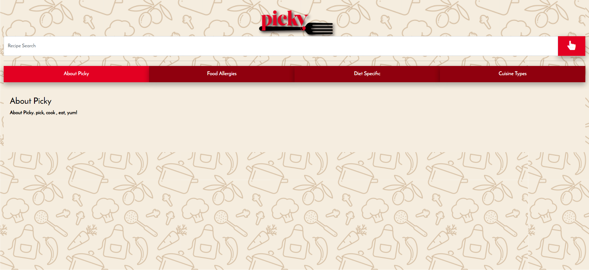

# Project 1: Picky

#### Description 
---

This app was designed to help busy people find recipes quickly while still being mindful of allergies and diet preferences, and allowing them the access to email themselves ingredients required.
#### Table of Contents
---

* [Installation](#installation)
* [Usage](#usage)
* [Credits](#credits)
* [License](#license)
* [Badges](#badges)
#### Installation
---
To successfully install this project you need to do the following:

1. Create a account at Spoonacular API and Email.js API.
1. Start making the html page, which should include our four main html elements: search area, tabs with content, DOM area below tabs, and modals with DOM areas.
1. In javascript write code to perform the AJAX calls to get the information needed to display the recipe and related information into the DOM area.  We decided to display 10 recipes per call.
1. Develop the functions to make your buttons for allergens, diets, and cuisines functional and add to the url you send into the API.
1. In the modal areas display the recipe and ingredient information when the approriate button is clicked, show recipe and show ingredients, respectively.
1. Lastly, make a clear button to reset the DOM elements and all variables back to base state, so the user can re-search for another recipe(s).

#### Usage
---

Git Hub Repository: [https://github.com/ncastaldi/project1](#https://github.com/ncastaldi/project1)

Live Site: [https://www.castaldi.dev/project1/index.html](#https://www.castaldi.dev/project1/index.html)

#### Credits
---

**Created By:**
* Daniel Guadalupe ([GitHub](https://github.com/danielthomas129))
* John Erler ([GitHub](https://github.com/jerler1))
* Mya Todd ([GitHub](https://github.com/mt428376))
* Nathan Castaldi ([GitHub](https://github.com/ncastaldi))

**API's Used:**
* [EmailJS](#https://www.emailjs.com/)
* [Spoonacular](#https://spoonacular.com/)
#### License
---

MIT License

Copyright (c) [2020] [Daniel Guadalupe, John Erler, Mya Todd, Nathan Castaldi]

Permission is hereby granted, free of charge, to any person obtaining a copy
of this software and associated documentation files (the "Software"), to deal
in the Software without restriction, including without limitation the rights
to use, copy, modify, merge, publish, distribute, sublicense, and/or sell
copies of the Software, and to permit persons to whom the Software is
furnished to do so, subject to the following conditions:

The above copyright notice and this permission notice shall be included in all
copies or substantial portions of the Software.

THE SOFTWARE IS PROVIDED "AS IS", WITHOUT WARRANTY OF ANY KIND, EXPRESS OR
IMPLIED, INCLUDING BUT NOT LIMITED TO THE WARRANTIES OF MERCHANTABILITY,
FITNESS FOR A PARTICULAR PURPOSE AND NONINFRINGEMENT. IN NO EVENT SHALL THE
AUTHORS OR COPYRIGHT HOLDERS BE LIABLE FOR ANY CLAIM, DAMAGES OR OTHER
LIABILITY, WHETHER IN AN ACTION OF CONTRACT, TORT OR OTHERWISE, ARISING FROM,
OUT OF OR IN CONNECTION WITH THE SOFTWARE OR THE USE OR OTHER DEALINGS IN THE
SOFTWARE.
## Badges
---

